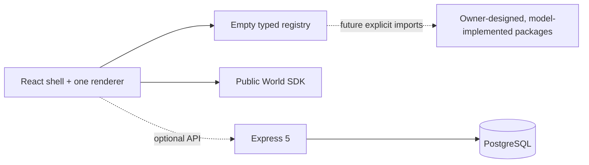

# Modelverse Platform

Modelverse is a mobile-friendly browser multiverse platform for owner-designed open-world sandboxes implemented as isolated packages by different coding models. This repository contains the platform laws and infrastructure only. It intentionally ships with **no registered worlds**.

## What is included

- One React application, React Three Fiber canvas, WebGL renderer, and render loop
- Public World SDK with manifest validation and explicit lifecycle/disposal contracts
- Empty, local-only dynamic world registry
- Portal state, crossing, and transform primitives
- Raw keyboard, mouse, pointer-lock, touch, gamepad, and orientation input
- Reusable mobile control components
- Device quality selection and sustained-frame degradation
- IndexedDB local-first persistence and versioned schemas
- Express 5 API, Prisma, PostgreSQL migration, and Supertest coverage
- Vitest, Playwright, ESLint, Prettier, Docker Compose, Caddy, and CI
- An unregistered `worlds/template` package for future world authors to copy

The browser displays an engine-owned wireframe diagnostic marker. It is a renderer smoke test, not a world.



## Quick start

Requirements: Node 22+ and pnpm 11+.

```bash
cp .env.example .env
pnpm install
pnpm dev
```

Open `http://localhost:5173`. A successful foundation boot shows:

- a wireframe cube over a grid;
- “Platform shell ready”;
- “No worlds are registered”;
- a working Debug button and graphics-quality selector.

The optional API health endpoint is `http://localhost:3001/health`. The browser shell still works when PostgreSQL or the API is unavailable.

## Verify the foundation

```bash
pnpm lint
pnpm typecheck
pnpm test
pnpm build
pnpm --filter @modelverse/web exec playwright install chromium # first run only
pnpm test:e2e
pnpm format:check
```

See [Testing the foundation](docs/testing.md) for expected results, manual browser checks, API checks, database migration checks, and troubleshooting.

## Repository map

```text
apps/web               Browser shell and smoke harness
apps/api               Express API and Prisma schema
packages/engine        Shell state and device quality
packages/world-sdk     Public contract for future worlds
packages/input-system  Raw input and reusable touch UI
packages/portal-system Portal state and geometry
packages/save-system   Local-first persistence
packages/provenance    World provenance schema
packages/shared-types  Cross-platform schemas
packages/testing       World compatibility helpers
worlds/template        Unregistered copy-only authoring template
docs                    Architecture, testing, and authoring guides
infra                   Caddy and production Compose
```

## Adding worlds later

The project owner defines every world concept and completes its creative brief. An assigned model implements that brief in isolation; it does not choose the product's worlds. Start with the [owner workflow](docs/adding-a-world.md), [creative-brief template](docs/world-brief-template.md), and [canonical fresh-chat prompt](docs/world-author-prompt.md).

World packages are explicitly reviewed before registration. The platform never discovers or executes arbitrary remote JavaScript.

For a fresh authoring chat: run `pnpm create:world <world-id>`, complete its `WORLD_BRIEF.md`, run `pnpm install`, then paste [the canonical prompt](docs/world-author-prompt.md) into a new chat with repository access. The prompt prevents the implementation model from filling creative gaps or editing the platform.

The complete documentation map is in [docs/README.md](docs/README.md).

## SDK status

The SDK is pre-1.0 and intentionally not frozen. The platform contracts compile and have unit coverage, but they have not yet been proven by independently authored worlds.

See [Contributing](CONTRIBUTING.md), [Security](SECURITY.md), and the [platform ADR](docs/adr/0001-platform-foundation.md).

Modelverse is available under the [MIT License](LICENSE).
